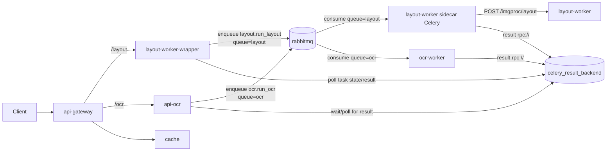

# Preliminary global API logic for Mezanno
Preliminary work on a unified deployment and management of APIfied services for Mezanno, in a scalable way:
- API gateway
- Image cache
- Distributed task queue
- Monitoring
- Workers and their eventual wrappers

## Build and Run

### For layout analysis worker
Clone worker's sources:
```sh
git clone --depth 1 https://github.com/soduco/directory-annotator-back.git layout-worker/code
```

### When everything is ready
Then build and run everything at once:
```sh
docker compose up
```

## Use

- **Layout analysis (async via Celery)**  
  - Enqueue: `GET http://127.0.0.1:8200/layout?image_url=...` → returns `{"task_id": "..."}`.  
  - Poll result: `GET http://127.0.0.1:8200/layout/result?task_id=...`.
  - Internally routed to the `layout` Celery queue and processed by the **layout-worker sidecar**, which calls the co-located C++ `layout-worker` server.

## Breaking change: layout is now async (polling)

`GET /layout` no longer returns the layout JSON synchronously.

Updated contract:

- Before: `GET /layout?...` returned the layout JSON directly.
- Now:
  - `GET /layout?...` returns `{"task_id": "..."}`.
  - Clients must retrieve the actual layout via `GET /layout/result?task_id=...` (poll until `ready: true`, then read `result` or `error`).

- **OCR (async via Gradio + Celery)**  
  - UI and HTTP API exposed at `http://127.0.0.1:8200/ocr` (Gradio app in `api-ocr`).  
  - Requests are forwarded to the `ocr` Celery queue and processed by `ocr-worker`.


## Clean-up
```sh
docker compose down; \
docker image rm \
    global-api-draft-api-gateway \
    global-api-draft-cache \
    global-api-draft-layout-worker-wrapper \
    global-api-draft-layout-worker
```


## Architecture and notes

### High-level data flow



- **API gateway (`api-gateway`)**  
  - Caddy-based reverse proxy.  
  - Routes `/layout` to `layout-worker-wrapper` and `/ocr` to `api-ocr`.  
  - Rewrites allowed external `image_url` values to use the internal `cache` service when possible and blocks unsafe internal targets.

- **Image cache (`cache`)**  
  - Nginx-based HTTP cache for IIIF and similar image sources.  
  - Used transparently by the gateway for known hosts (e.g. BnF IIIF).

- **Task queue (`rabbitmq` + Celery)**  
  - RabbitMQ as the Celery broker, `rpc://` as the result backend.  
  - Two main queues:
    - `ocr` for OCR tasks (`ocr.run_ocr`).  
    - `layout` for layout analysis tasks (`layout.run_layout`).  
  - Workers are started with `-Q ocr` or `-Q layout` so each pool can be scaled independently.

- **Layout HTTP wrapper (`layout-worker-wrapper`)**  
  - FastAPI application exposing:
    - `GET /layout` → enqueues `layout.run_layout` (queue `layout`) and returns `{"task_id": ...}`.  
    - `GET /layout/result` → polls Celery and returns `{state, ready, result|error}`.  
  - Does **not** run heavy computation itself; just orchestrates Celery.

- **Layout worker sidecar (`layout-worker`)**  
  - Runs the C++ image-processing server (directory-annotator-back) exposing `POST /imgproc/layout`.  
  - Runs a co-located Python Celery worker that:
    - Downloads the image from `image_url`.  
    - `POST`s bytes to `http://127.0.0.1:8000/imgproc/layout`.  
    - Returns the JSON layout response to Celery clients.  
  - Listens on the `layout` queue only.

- **OCR API (`api-ocr`)**  
  - Gradio-based HTTP API exposing `/ocr` with a simple UI and JSON API.  
  - Uses a Celery `Celery` app pointing at RabbitMQ and enqueues `ocr.run_ocr` to the `ocr` queue.  
  - Waits asynchronously for Celery results with exponential backoff and timeout.

- **OCR worker (`ocr-worker`)**  
  - Python Celery worker wrapping PERO OCR.  
  - Task name `ocr.run_ocr`:
    - Downloads the image.  
    - Runs PERO OCR on specified regions (or the full page).  
    - Returns structured JSON with engine metadata and line transcriptions.  
  - Listens on the `ocr` queue only.

- **Monitoring (`flower`)**  
  - Celery Flower UI exposed on `http://127.0.0.1:8205`.  
  - Lets you inspect workers, queues (`ocr`, `layout`), and task status.

## Planned improvements

- **Testing**: implement a solid automated test suite (unit + integration) for the API gateway, wrappers, Celery tasks, and deployment scripts.
- **Server-side events service**: introduce a dedicated SSE/WebSocket/long-poll service so clients can receive real-time updates for long-running tasks without depending on Gradio or keeping HTTP requests open.
- **Unified API contract**: ensure both layout analysis and OCR expose the same high-level API logic and response envelope (enqueue → task id, status, result, error).
- **Caching**: improve the image caching service (e.g. cache policies, storage backends, cache invalidation and observability).
- **Fair use limits**: add protections so a single client cannot saturate the task queue (rate limiting, per-client concurrency caps, and per-queue backpressure policies).
- **Auth, metering, and billing**: enable client authentication, usage monitoring, quota/limit enforcement, priority balancing between clients, and eventually billing-friendly metrics.

## Deploy
```shell
01-docker_compose_build.sh
02-docker_images_tag.sh

docker image ls | grep mezanno
# note the tag you want to use, e.g, v20250417-1557
export MZN_TAG=???
03-docker_image_save.sh $MZN_TAG

# Copy images to server(s) --- should use some registry here
export MZN_SRV=???
ssh $MZN_SRV mkdir -p tmp/mezanno-images
rsync -avih ~/tmp/mezanno-images/mezanno*-${MZN_TAG}.tar.gz $MZN_SRV:tmp/mezanno-images

# Distribute among worker server
export MZN_WORKER_SRV=???
# ssh $MZN_SRV
# cd tmp/mezanno-images
parallel --tag rsync {1} {2}:{1} ::: tmp/mezanno-images/mezanno*-${MZN_TAG}.tar.gz ::: $MZN_WORKER_SRV

# Import images
parallel --tag ssh {} 'docker image ls' ::: $MZN_WORKER_SRV
parallel --tag ssh {2} 'docker load < {1}' ::: tmp/mezanno-images/mezanno*-${MZN_TAG}.tar.gz ::: $MZN_WORKER_SRV

# or
ansible all -m shell -i hosts-ssh  -a 'for img in tmp/mezanno-images/mezanno*.tar.gz ; do echo "docker load < $img" ; done'

```

Then copy the docker swarm compose file, and run all the services.

```shell
docker stack deploy -c docker-compose-swarm.yml mezanno-api
```
